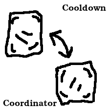

# Cooldown Coordinator
Fabric library to help mods coordinate item movement cooldowns

## What it Does
Cooldown Coordinator is a library mod intended to enable heterogeneous networks
of vanilla hoppers and item transferring modded block entities to move items
throughout the network in a vanilla-alike and consistent manner.  For example,
one goal is to allow sorters consisting of a mixture of vanilla and modded
hoppers, ducts, etc. to behave predictably.

## How Does it Do it?
The mod provides an interface to implement and a method to call when a cooldown
should be triggered.  The method may safely be called with any BlockEntity as
its argument.  When the target BE implements the interface, it will be notified
of the cooldown and can take whatever action it deems appropriate.  As a special
case, the portion of vanilla hopper transfer code which handles cooldowns is
emulated when the method is called with an instance of HopperBlockEntity that
does not also implement our interface.

## How to Use this Library
For now, the best documentation is in the library's javadocs.  There are some
important details (f.e. how to know when a cooldown should be triggered) which
I intend to document properly once the mod is a bit more mature.

## Future Goals
I would like this mod or something similar to be part of the Fabric API.  At
present, it is somewhere between an RFC and a WIP.  If it performs as intended
and there is interest from the Fabric community, I intend to maintain the mod
until (and beyond) it becomes part of Fabric or something better comes along.
